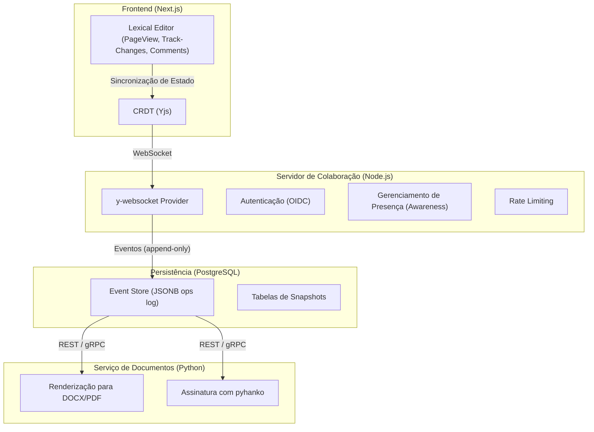

# Projeto de Editor Web para o Sistema de Tramitação Parlamentar

Este documento detalha a arquitetura e a stack tecnológica para um editor web avançado, similar ao Google Docs/Word, focado nas necessidades do Sistema de Tramitação Parlamentar.

## Requisitos Chave

-   Layout de página A4 com quebra automática.
-   Comentários e controle de alterações (track-changes).
-   Colaboração em tempo real.
-   Exportação para PDF e Word (.docx).
-   Assinatura digital padrão ICP-Brasil.

---

## 1 — Stack Recomendada

A seleção de tecnologias visa performance, extensibilidade e o uso de licenças permissivas.

| Camada | Tecnologia | Por quê |
| :--- | :--- | :--- |
| **Kernel do editor** | Lexical (Meta) + React | Motor DOM minimalista, diferenciado por reconciliação incremental: edita nós específicos sem repintar o resto, mantendo 60 fps em textos longos. Extensível via Node e Plugin APIs. |
| **Colaboração em tempo real** | Yjs (OT/CRDT) + Liveblocks ou self-hosted y-websocket | Integração oficial com Lexical, resolve conflitos off-line e escala horizontalmente. |
| **Paginação A4** | Plugin custom "PageView" para Lexical | Implementa: medição de altura + virtualization (React-Window) → só renderiza páginas visíveis. Exemplo de PageBreakNode em Lexical: [StackOverflow](https://stackoverflow.com/questions/76107037/how-to-implement-a-page-break-node-in-lexical-editor-for-a4-size-pages). |
| **Track Changes & Comentários** | Extensão própria sobre Lexical "MarkNode" + painel lateral | Estratégia similar aos exemplos internos do [Lexical Commenting repo](https://github.com/facebook/lexical/tree/main/packages/lexical-playground/src/plugins/CommentsPlugin); anotações armazenadas como "marks" no AST, sincronizadas pelo CRDT. |
| **Exportação** | • `@lexical/export-docx` (para .docx) • PagedJS → HTML → PDF | Mantém quebras e estilos; PagedJS respeita CSS `@page`/`break-after`. |
| **Assinatura ICP-Brasil** | API back-end Python (FastAPI) chamando `pyhanko` | Transforma o PDF gerado em PDF-A/3 + assinatura PAdES com carimbo de tempo. |
| **Persistência** | PostgreSQL JSONB + Event Sourcing | Grava eventos Lexical/Yjs para auditoria (requisito legislativo). |

**Resultado esperado:** editor leve (bundle ≈ 140 kB gzip), renderização paginada fluida, e recursos "Word-like" sob licença MIT.

---

## 2 — Arquitetura de Alto Nível

-   **Escalabilidade**: O uso de CRDT permite *sharding*; apenas o *diff* mínimo do estado é trafegado pela rede.
-   **Conformidade**: O *event log* imutável atende a requisitos de auditoria, e o PDF assinado cumpre as exigências legais para documentos oficiais.

---

## 3 — Comparativo de Bibliotecas (2025)

| Critério | Lexical | CKEditor 5 (+ Plugins Pagos) | Tiptap v3 (ProseMirror) |
| :--- | :--- | :--- | :--- |
| **Desempenho** | ⭐⭐⭐⭐ (virtual DOM granular) | ⭐⭐ (peso ~550 kB; UI pesada) | ⭐⭐⭐ (bom, mas re-render amplo) |
| **Paginação A4** | Plugin artesanal necessário | Pronto e mantido (pago) | Exige custom node + hacks |
| **Track Changes & Comentários** | Construir sobre nodes & marks | Pronto (pago/licença SaaS) | Plugins de terceiros, menos maduros |
| **Licença** | MIT (open) | GPL + Comercial para extras | MIT |
| **Colaboração** | Nativo (Yjs adapter) | SaaS Real-time collab (pago) | Extensão Yjs/Collab (manual) |
| **TCO (Custo Total)** | Baixo (desenvolvimento customizado) | Médio-alto (licença) | Baixo |

### Recomendação Prática

1.  **Lexical**: É a melhor base se o time aceita desenvolver plugins customizados. Oferece alta performance, um *bundle* final enxuto e uma licença permissiva.
2.  **CKEditor 5**: Acelera o *time-to-market* se o projeto exige pronta-entrega de paginação e *track-changes* e o orçamento cobre a licença comercial.
3.  **Tiptap**: Continua sendo uma excelente opção onde a equipe já domina o ecossistema ProseMirror, mas exigirá o mesmo esforço de paginação que o Lexical sem os mesmos ganhos de desempenho. 