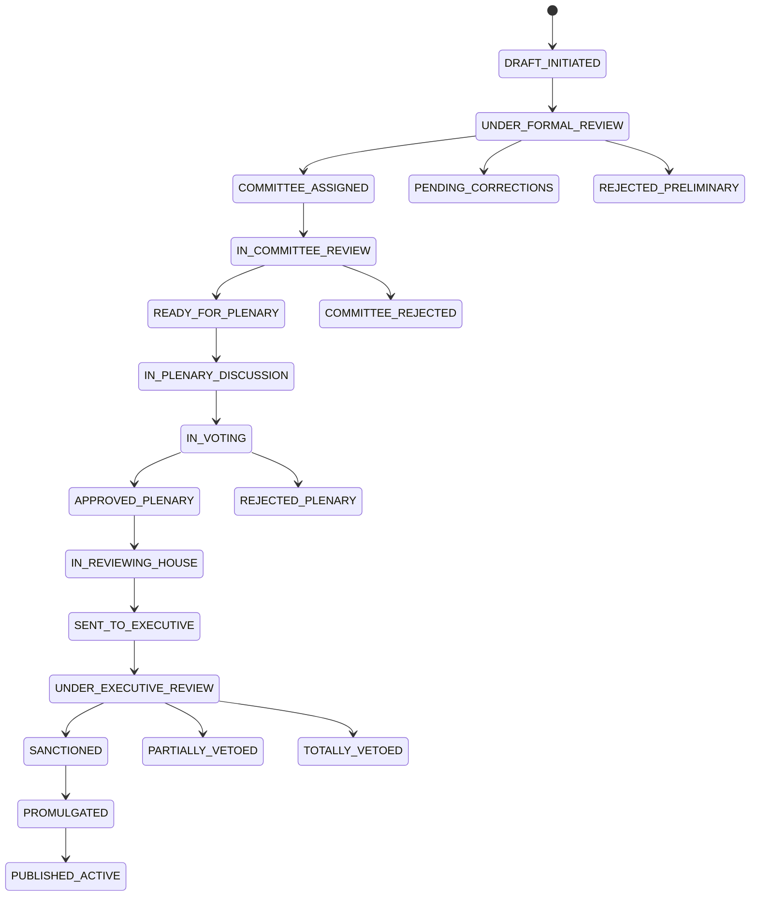

# 🏛️ Fluxos de Tramitação Parlamentar - Sistema Completo

## 🎯 **Visão Geral do Sistema de Tramitação**

Este documento mapeia o **fluxo completo de tramitação parlamentar** com todos os setores, estados, transições e processos técnicos necessários para implementação no sistema Next.js.

### 📊 **Estados Principais do Sistema**


---

## 1. **FASE DE CRIAÇÃO E RECEPÇÃO**

### 1.1 Portal de Entrada (Document Ingestion Service)
**Estado Inicial**: `DRAFT_INITIATED`

**Setores Envolvidos**:
- **Protocolo Geral**: Primeira recepção e numeração sequencial
- **Assessoria de Redação Legislativa**: Validação técnica inicial
- **Secretaria de Comissões**: Distribuição temática

**Processo Técnico**:
```typescript
interface DocumentSubmissionEvent {
  event: 'DocumentSubmitted'
  payload: {
    documentId: string
    authorId: string
    documentType: PropositionType
    content: AkomaNtosoDocument
    metadata: DocumentMetadata
  }
  validations: {
    formatCompliance: boolean
    authorityValidation: boolean
    thematicClassification: string[]
    autoGeneratedId: string
  }
}
```

**Funções dos Setores**:
- **Protocolo**: Registro temporal, numeração, validação de autoria
- **Redação**: Análise de conformidade técnica, sugestões de estrutura
- **Secretaria**: Routing para comissão competente baseado em regras de negócio

**Transição de Estado**: `DRAFT_INITIATED` → `UNDER_FORMAL_REVIEW`

### 1.2 Análise Preliminar (Legal Review Service)
**Estado**: `UNDER_FORMAL_REVIEW`

**Setores Envolvidos**:
- **Consultoria Jurídica**: Análise constitucional e legal
- **Assessoria Técnica**: Verificação de impacto orçamentário
- **Secretaria da Mesa**: Verificação de competência e tramitação

**Processo Técnico**:
```typescript
interface LegalReviewWorkflow {
  parallelAnalysis: {
    juridicalReview: ConstitutionalAnalysis
    technicalReview: BudgetaryImpactAnalysis
    administrativeReview: CompetenceVerification
  }
  businessRules: AdmissibilityRules
  decision: 'APPROVED' | 'REJECTED' | 'REQUIRES_CORRECTIONS'
  consolidatedOpinion: ReviewConsolidation
}
```

**Critérios de Validação**:
- Constitucionalidade (análise automática + manual)
- Competência legislativa
- Impacto orçamentário
- Técnica legislativa
- Precedentes e jurisprudência

**Possíveis Transições**:
- `UNDER_FORMAL_REVIEW` → `COMMITTEE_ASSIGNED` (aprovado)
- `UNDER_FORMAL_REVIEW` → `PENDING_CORRECTIONS` (diligências)
- `UNDER_FORMAL_REVIEW` → `REJECTED_PRELIMINARY` (rejeitado)

---

## 2. **FASE DE COMISSÕES**

### 2.1 Distribuição e Atribuição (Committee Assignment Service)
**Estado**: `COMMITTEE_ASSIGNED`

**Setores Envolvidos**:
- **Secretaria de Comissões**: Coordenação geral
- **Secretarias Específicas**: Por área temática (CCJ, CDHM, CFT, etc.)
- **Assessoria de Plenário**: Agenda e cronograma

**Processo Técnico**:
```typescript
interface CommitteeRouter {
  thematicClassification: NLPClassification
  distributionRules: {
    primaryCompetence: CommitteeType[]
    crossCompetence: CommitteeType[]
    workloadBalance: WorkloadMetrics
    deadlineCompliance: RegimentalDeadlines
  }
  conflictVerification: UrgencyPriorityCheck
  automaticScheduling: AgendaScheduler
  multiChannelNotification: NotificationService
}

type CommitteeType = 
  | 'CCJ'     // Constituição e Justiça
  | 'CDHM'    // Direitos Humanos
  | 'CFT'     // Finanças e Tributação
  | 'CEDU'    // Educação
  | 'CSAUDE'  // Saúde
  | 'CMEIO'   // Meio Ambiente
  // ... outras comissões
```

**Algoritmo de Distribuição**:
- Competência temática primária
- Competência conexa (análise cruzada)
- Capacidade operacional
- Prazos regimentais
- Prioridades políticas

### 2.2 Análise em Comissão (Committee Review Service)
**Estado**: `IN_COMMITTEE_REVIEW`

**Setores Envolvidos**:
- **Secretaria da Comissão**: Suporte administrativo e processual
- **Consultoria Legislativa**: Estudos técnicos especializados
- **Assessoria de Imprensa**: Comunicação e transparência
- **Taquigrafia**: Registro de debates e votações

**Fluxo Detalhado**:
```typescript
interface CommitteeWorkflow {
  phases: {
    reception: {
      rapporteurAssignment: RapporteurAssignment
      amendmentPeriodOpen: AmendmentPeriod
      agendaPublication: AgendaItem
    }
    amendmentPhase: {
      amendmentReception: Amendment[]
      admissibilityAnalysis: AdmissibilityCheck[]
      substitutiveConsolidation: SubstitutiveDocument
    }
    rapporteurship: {
      opinionElaboration: RapporteurOpinion
      meritAnalysis: MeritAnalysis
      recommendationProposal: VotingRecommendation
    }
    discussionVoting: {
      reportPresentation: ReportPresentation
      singleTurnDiscussion: Discussion
      voting: CommitteeVoting
      minutesDrafting: OfficialMinutes
    }
    forwarding: {
      toOtherCommittees?: CommitteeForwarding
      toPlenarySession?: PlenaryForwarding
      toArchive?: ArchiveDecision
    }
  }
}
```

**Estados Intermediários**:
- `UNDER_RAPPORTEUR_ANALYSIS`
- `AMENDMENT_PERIOD_OPEN`
- `AMENDMENT_PERIOD_CLOSED`
- `COMMITTEE_DISCUSSION`
- `COMMITTEE_VOTING`
- `COMMITTEE_APPROVED`
- `COMMITTEE_REJECTED`

### 2.3 Gestão de Emendas (Amendment Management Service)
**Sistema Especializado**: Controle de versões e merge de alterações

**Processo Técnico**:
```typescript
interface AmendmentEngine {
  versionControl: GitLikeDocumentControl
  conflictDetection: OverlapAnalysis
  semanticAnalysis: ChangeImpactAnalysis
  autoMerge: CompatibleAmendmentMerger
  manualReview: ConflictResolver
  substitutiveGeneration: SubstitutiveBuilder
}

type AmendmentType = 
  | 'SUPRESSIVA'     // Remoção de texto
  | 'SUBSTITUTIVA'   // Alteração de texto
  | 'ADITIVA'        // Acréscimo de texto
  | 'MODIFICATIVA'   // Alteração parcial
  | 'AGLUTINATIVA'   // Combinação de emendas
```

---

## 3. **FASE DE PLENÁRIO**

### 3.1 Preparação para Plenário (Plenary Preparation Service)
**Estado**: `READY_FOR_PLENARY`

**Setores Envolvidos**:
- **Secretaria-Geral da Mesa**: Organização da pauta
- **Departamento de Taquigrafia**: Preparação para registro
- **Assessoria de Plenário**: Logística e procedimentos
- **Coordenação de Comunicação**: Transmissão e publicidade

**Atividades**:
```typescript
interface PlenaryPreparation {
  quorumVerification: QuorumCheck
  agendaOrganization: OrderOfTheDay
  materialPreparation: {
    reports: CommitteeReports[]
    amendments: Amendment[]
    opinions: TechnicalOpinions[]
  }
  votingSystemSetup: VotingSystemConfig
  speakerScheduling: SpeakerSchedule
}
```

### 3.2 Discussão em Plenário (Plenary Discussion Service)
**Estado**: `IN_PLENARY_DISCUSSION`

**Processo Regrado**:
```typescript
interface PlenaryWorkflow {
  firstDiscussion: {
    focus: 'GENERALITIES'
    committeeReport: ReportPresentation
    meritDiscussion: MeritDebate
    votingEncouragement: VotingEncouragement
  }
  secondDiscussion: {
    focus: 'SPECIFICITIES'
    articleByArticle: ArticleByArticleReview
    plenaryAmendments: PlenaryAmendment[]
    highlights: HighlightedItems[]
  }
  finalVoting: {
    globalVoting: GlobalVote
    quorumVerification: FinalQuorumCheck
    resultProclamation: VotingResult
  }
}
```

### 3.3 Sistema de Votação (Voting Management Service)
**Estado**: `IN_VOTING`

**Arquitetura Técnica**:
```typescript
interface VotingSystem {
  terminals: ElectronicVotingTerminal[]
  authentication: BiometricAuth
  realTimeCount: RealTimeVoteCounter
  blockchainRecord: ImmutableVoteRecord
  liveDashboard: LiveResultsDashboard
  quorumVerification: AutomaticQuorumVerifier
}

type VotingType = 
  | 'SIMBOLICA'   // Manifestação simples
  | 'NOMINAL'     // Registro individual
  | 'SECRETA'     // Proteção do voto
  | 'ELETRONICA'  // Sistema automatizado

type VotingResult = 
  | 'APPROVED_PLENARY'      // Segue tramitação
  | 'REJECTED_PLENARY'      // Arquivo
  | 'RETURNED_TO_COMMITTEE' // Nova análise
```

---

## 4. **FASE BICAMERAL (Sistema Bicameral)**

### 4.1 Tramitação na Casa Revisora
**Estado**: `IN_REVIEWING_HOUSE`

**Fluxo Espelhado**:
```typescript
interface BicameralFlow {
  formalReception: DocumentReception
  committeeDistribution: CommitteeAssignment
  technicalAnalysis: TechnicalReview
  discussionVoting: ReviewHouseVoting
  possibilities: {
    approvedWithoutChanges: () => 'SENT_TO_EXECUTIVE'
    approvedWithChanges: () => 'RETURNED_TO_INITIATING_HOUSE'
    rejected: () => 'REJECTED_REVIEWING_HOUSE'
  }
}
```

### 4.2 Resolução de Conflitos (Bicameral Resolution Service)
**Estado**: `BICAMERAL_CONFLICT`

**Mecanismos**:
```typescript
interface ConflictResolution {
  divergenceAnalysis: DivergenceMapping
  jointCommittee?: JointCommitteeProcess
  politicalNegotiation: NegotiationProcess
  finalVoting: InitiatingHouseFinalVote
}
```

---

## 5. **FASE EXECUTIVA**

### 5.1 Encaminhamento ao Executivo (Executive Submission Service)
**Estado**: `SENT_TO_EXECUTIVE`

**Setores Envolvidos**:
- **Secretaria-Geral**: Autenticação e encaminhamento
- **Protocolo do Executivo**: Recepção formal
- **Casa Civil**: Coordenação da análise

### 5.2 Análise Executiva (Executive Review Service)
**Estado**: `UNDER_EXECUTIVE_REVIEW`

**Processo**:
```typescript
interface ExecutiveAnalysis {
  constitutionalityAnalysis: AGUAnalysis
  meritAnalysis: MinistryAnalysis[]
  impactAnalysis: EconomicImpactAnalysis
  consolidatedOpinion: CasaCivilOpinion
  presidentialDecision: PresidentialDecision
}

type PresidentialDecision = 
  | 'SANCTIONED'        // Promulgação
  | 'PARTIALLY_VETOED'  // Veto parcial
  | 'TOTALLY_VETOED'    // Veto total
  | 'TACIT_SANCTION'    // Sanção tácita (15 dias)
```

---

## 6. **FASE DE FINALIZAÇÃO**

### 6.1 Promulgação e Publicação (Publication Service)
**Estado**: `PROMULGATED`

**Setores Envolvidos**:
- **Secretaria de Editoração**: Formatação final
- **Diário Oficial**: Publicação oficial
- **Portal da Transparência**: Disponibilização pública
- **Arquivo Nacional**: Preservação histórica

### 6.2 Controle de Constitucionalidade (Judicial Review Tracking)
**Estado**: `PUBLISHED_ACTIVE`

**Monitoramento**:
```typescript
interface ConstitutionalityControl {
  adi: ADITracking  // Ação Direta de Inconstitucionalidade
  adc: ADCTracking  // Ação Declaratória de Constitucionalidade
  adpf: ADPFTracking // Arguição de Descumprimento
}
```

---

## 7. **ESTADOS TERMINAIS E ESPECIAIS**

### 7.1 Estados de Arquivo
```typescript
type ArchiveStates = 
  | 'REJECTED_PRELIMINARY'
  | 'REJECTED_COMMITTEE'
  | 'REJECTED_PLENARY'
  | 'VETOED_TOTALLY'
  | 'UNCONSTITUTIONAL'
```

### 7.2 Estados de Suspensão
```typescript
type SuspensionStates = 
  | 'SUSPENDED_COURT_ORDER'
  | 'SUSPENDED_POLITICAL'
  | 'SUSPENDED_PROCEDURAL'
```

### 7.3 Estados de Transformação
```typescript
type TransformationStates = 
  | 'TRANSFORMED_INTO_LAW'
  | 'INCORPORATED_INTO_OTHER_PROJECT'
  | 'SUPERSEDED_BY_NEW_PROJECT'
```

---

## 8. **INTEGRAÇÃO E NOTIFICAÇÕES**

### 8.1 Event Bus Architecture
```typescript
interface EventBus {
  events: {
    StateTransitionEvent: StateTransition
    WorkflowProgressEvent: WorkflowProgress
    DeadlineWarningEvent: DeadlineWarning
    UserActionEvent: UserAction
    SystemStatusEvent: SystemStatus
  }
}
```

### 8.2 Notification Matrix
```typescript
interface NotificationMatrix {
  stakeholders: {
    autor: NotificationLevel.ALL_TRANSITIONS
    relator: NotificationLevel.ASSIGNMENT_AND_COMMITTEE_STATUS
    presidenteComissao: NotificationLevel.ENTRY_AND_DEADLINES
    lideranca: NotificationLevel.VOTING_AND_RESULTS
    publico: NotificationLevel.PUBLIC_STATES_AND_PUBLICATIONS
    imprensa: NotificationLevel.PUBLIC_INTEREST_EVENTS
  }
}
```

---

## 9. **MÉTRICAS E MONITORAMENTO**

### 9.1 KPIs do Sistema
```typescript
interface SystemKPIs {
  timeMetrics: {
    averageTimePerPhase: PhaseTimeMetrics
    approvalRateByType: ApprovalRateMetrics
    efficiencyByCommittee: CommitteeEfficiencyMetrics
  }
  participationMetrics: {
    amendmentVolume: AmendmentVolumeMetrics
    citizenParticipation: CitizenParticipationMetrics
  }
}
```

### 9.2 Alertas Automatizados
```typescript
interface AutomatedAlerts {
  deadlineWarnings: DeadlineAlert[]
  quorumInsufficient: QuorumAlert[]
  scheduleConflicts: ScheduleConflictAlert[]
  committeeOverload: OverloadAlert[]
  processAnomalies: AnomalyAlert[]
}
```

---

**Este fluxo garante**:
- ✅ **Rastreabilidade completa** de todas as etapas
- ✅ **Compliance regulatório** com normas parlamentares
- ✅ **Eficiência operacional** através de automação inteligente
- ✅ **Integração sistêmica** entre todos os setores
- ✅ **Transparência total** para todos os stakeholders

**Implementação**: Este fluxo será a base para o desenvolvimento dos workflows, estados e APIs do sistema Next.js de tramitação parlamentar. 